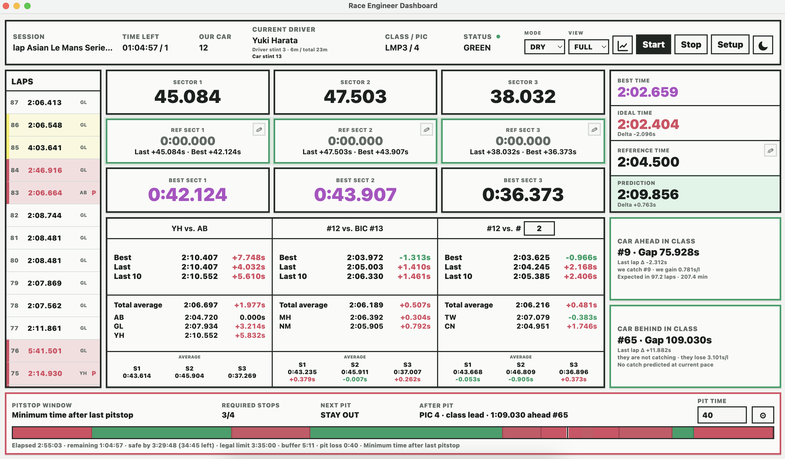

# MSTC Race Engineer Dashboard

Desktop dashboard voor live timing analyse tijdens motorsportwedstrijden.

De app leest live timingdata, bewaart rondes lokaal en zet die data om in nuttige
informatie voor een race engineer: rondetijden, sectoren, vergelijkingen,
pitstopplanning, stintinformatie en automatische race-/stintverslagen.

## Screenshot

## Functionaliteiten

- Live timing uitlezen van ondersteunde timingwebsites.
- Een of meerdere auto's tegelijk volgen.
- Rondetijden en sectoren lokaal opslaan per sessie.
- Race-, quali- en practice-modus.
- Droog, nat en intermediate/transition condities bijhouden.
- Beste tijden, gemiddelde tijden en laatste 10 rondes vergelijken.
- Vergelijkingen met auto's in dezelfde klasse.
- Gap- en catch-informatie voor auto's voor en achter ons.
- Pitstop window en verplichte pitstopplanning.
- Automatische PDF-verslagen per stint en voor de volledige race.
- Grafiekvenster met lap-, sector- en class pace analyses.
- Light en dark mode.

## Data

De app bewaart data in de gekozen sessiemap. Daardoor kan een sessie na een
crash of herstart opnieuw geopend worden zonder de eerdere rondes kwijt te zijn.

Belangrijke opgeslagen data:

- live timing snapshots
- lap history
- sector history
- session metadata
- pitstopinformatie
- track condition events
- analytics summaries

## Builds

Releases voor macOS en Windows worden via GitHub Actions gemaakt wanneer een
nieuwe versie/tag wordt gepusht.

## Doel

Het doel van dit project is om live timing bruikbaarder te maken voor echte
racebeslissingen. De officiële timingpagina toont de ruwe data; dit dashboard
maakt daar teamgerichte informatie van die sneller te begrijpen is tijdens een
race. 
